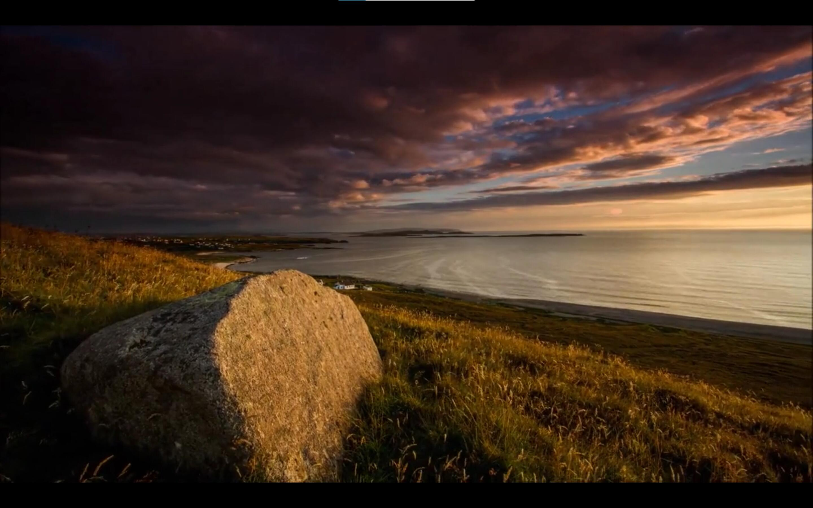
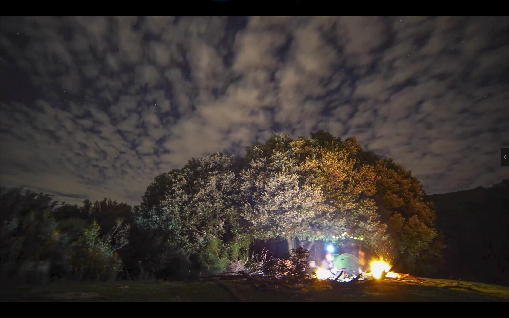
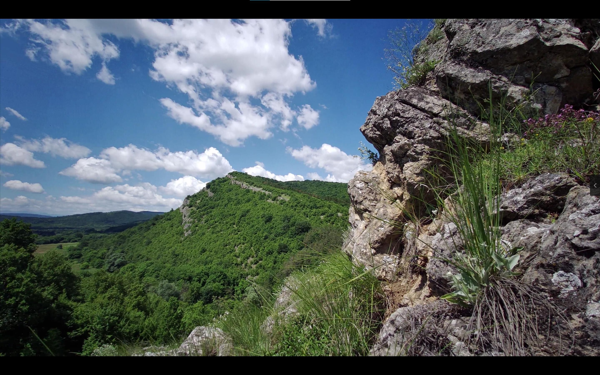
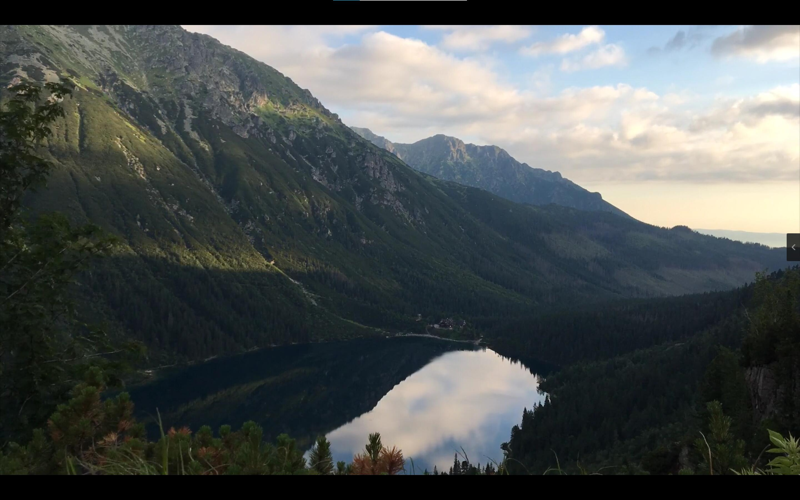
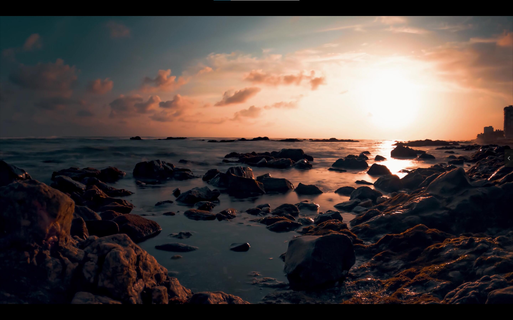
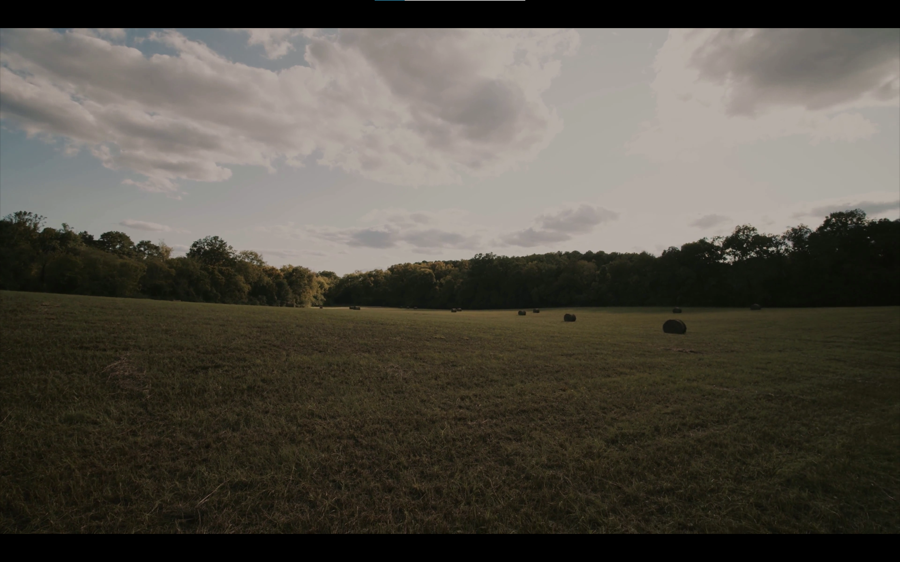
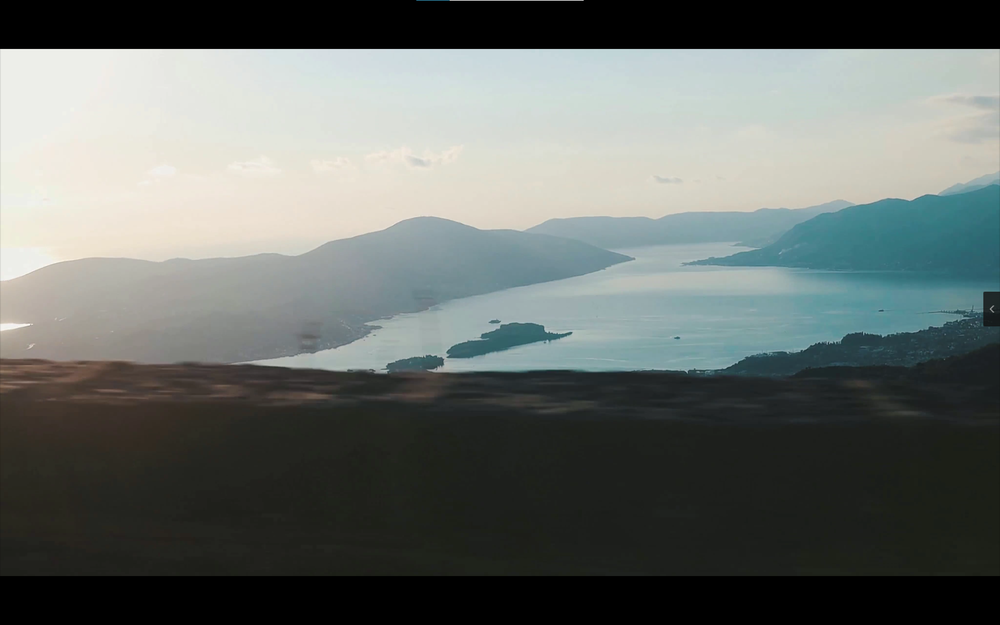

# 1. Motivation

Time-lapse photography is employed in movies and promotional films because it can reflect the passage of time in a short time and strengthen the visual attraction. However, since it takes a long time and requires the stable shooting, it is a great challenge for the photographer. In this article, we propose a time-lapse photography system with virtual and real robots.

# 2. Framework

No public. 

# 3. System

## Demo

- [youtube link](https://www.youtube.com/watch?v=sYFglVIJXd8)

​		

## How to use the system

1. Download and install [Carla 0.9.12 (linux)](https://carla.readthedocs.io/en/0.9.12/build_linux/), then make sure you can open `CarlaUE4.uproject` with [UE4.24](https://www.unrealengine.com/zh-CN) successfully. 

2. Replace the content in [google drive](https://drive.google.com/file/d/1gyDmXDJ2BrOcu7pLzOITsyHAi8zr9YQA/view?usp=sharing) to `~/Carla/Unreal/CarlaUE4/Content/Carla/` folder.
3. Recompile the project.
4. Open the project, then you can run the system and interact. Specifically, follow the steps below:
   - Step 1: Choose scene
     - Virtual scene: Town02, Town10...
     - Real scene: Town05, there are two models of real scenes that I've reconstructed. 
   - Step 2: View Finder
     - Use WSAD key to change camera's 6DOF pose.
   - Step 3: Camera movement
     - Choose one from four given local paths.
   - Step 4: Time-wrap
     - Choose start time, end time and time interval.
   - Step 5: Show result
     - Show global path, local path and details of each shot.

# 3. Dataset

We first collect more than 1200 videos from video sites(bilibili, pexels) with themes related to time-lapse photography, including architecture, car, crowds, forest, mountains, sky, street and sunset. Here we show some images of the **Time-lapse photography video dataset**, for full video examples, please download on the [google drive](https://drive.google.com/file/d/13FlWlOq7jVG9PTp3tGNhNHiK3YQT5VAI/view?usp=sharing). 

- good examples:

    
    
    
    
    

- bad examples:

    
    
    
    
    

# 4. Some Results

Here we choose three virtual scenes in carla, compare our results with amateurs and professional photographers. 

- [youtube link](https://www.youtube.com/watch?v=U13nDhQy-xo)

​		
